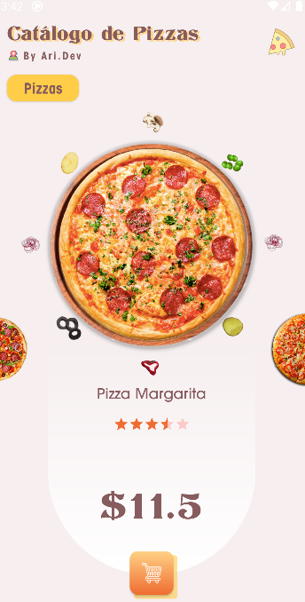
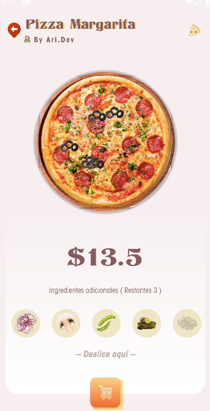

# AriPizza

         

App BUON APPETITO creada para el reto mensual organizado por [Mouredev](https://github.com/mouredev/Monthly-App-Challenge-2022) inspirada en el siguiente diseño
en [dribble](https://dribbble.com/shots/8154883-Pizza-order-system)

[Apk Demo ](app/demo/app-debug.apk)

## Se hizo uso de 🚀

- Kotlin
- Object Animator

## Sigueme en Twitter

[Twitter](https://twitter.com/anthony62411856)

## Invítame un Café 🖇️

Si algun componente del proyecto o el proyecto entero te ha sido de utilidad , me ayudaria bastante
para seguir compartiendo y desarrolando apps.

---
⌨️ con ❤️ por [Ari.dev](https://github.com/A-Cordero) 😊
